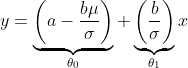

# ft_linear_regression (42)

A minimal, clean implementation of a **single-variable linear regression** trained with **batch gradient descent**.
It follows the 42 subject constraints: one predictor (mileage), hypothesis `θ0 + θ1 * mileage`, **simultaneous** updates of the parameters, and a separate predictor program.

- 📄 Subject: [Subject (PDF)](docs/ft_linear_regression.subject.pdf)

---

## What this repo contains

<strong>🧠 Technical Deep-Dive: Why Feature Scaling is Crucial</strong>

### The Problem: Why Scale Features?

Gradient descent optimizes parameters by moving in the direction of the steepest descent of the cost function. The "shape" of this cost function is highly sensitive to the scale of your input features.

When features have vastly different scales (e.g., mileage in the hundreds of thousands vs. a price in the thousands), the cost function becomes a steep, narrow ellipse. This forces the algorithm to "zig-zag" down the slope, requiring a tiny learning rate and resulting in slow or unstable convergence.

By **standardizing** the `km` feature, we reshape the cost function's contours to be more circular, allowing gradient descent to take a much more direct and efficient path to the optimal minimum.

---

### The Two-Phase Process

The implementation involves two critical phases: **standardization** before training and **de-standardization** after training.

#### 1. Standardization (Pre-Training)

We transform the original mileage `x` (in km) into a standardized feature `z` using the formula:

   $z = \frac{x - \mu}{\sigma}$

- **$\mu$ (mu)** is the mean of all mileage values.
- **$\sigma$ (sigma)** is the population standard deviation of all mileage values.

This transformation gives the new feature `z` a mean of `0` and a standard deviation of `1`. The script then trains the model on these standardized `z` values to learn the relationship:

   $y \approx a + b \cdot z $ 

#### 2. De-standardization (Post-Training)

The training yields parameters `a` and `b` that work for the standardized feature `z`. To make predictions using the original mileage `x`, we must convert `a` and `b` back into $\theta_0$ and $\theta_1$ for the final model:

$y \approx \theta_0 + \theta_1 \cdot x$

We derive the conversion by substituting the standardization formula back into our learned model:

1.  Start with the learned model:
    $y = a + b \cdot z$

2.  Substitute the definition of `z`:
    $y = a + b \cdot \left( \frac{x - \mu}{\sigma} \right)$

3. Distribute and rearrange to match the form y = θ₀ + θ₁·x :

This gives us the exact formulas to convert our learned parameters `a` and `b` back to the final $\theta_0$ and $\theta_1$:

- $\theta_1 = \frac{b}{\sigma}$
- $\theta_0 = a - \frac{b\mu}{\sigma}$

